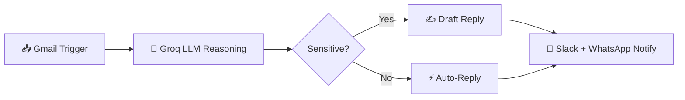
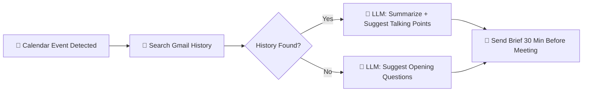
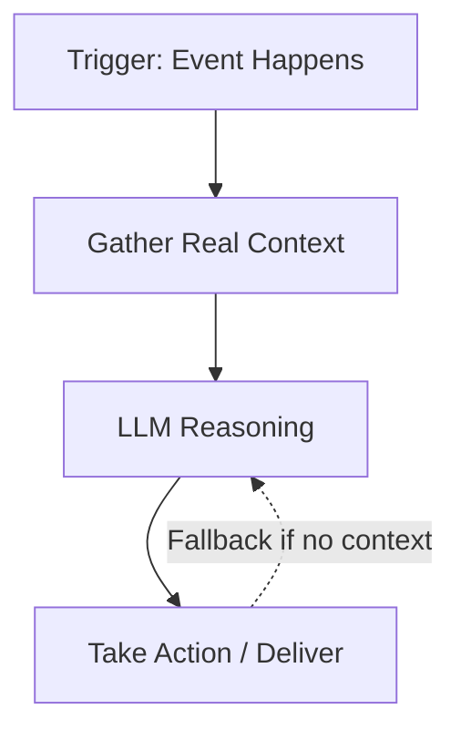

# 🤖 AI Agents — Real Workflows, Actually Deployed

**Two production-style automation agents built end-to-end — trigger → LLM reasoning → real-world delivery.**
Not tutorials. Not toy demos. Built by tracing every failure until it actually worked.

  
  
  
  
  
  

---

## 📋 Table of Contents

- [Why This Repo Exists](#-why-this-repo-exists)
- [Agent 1 — Email Automation Agent](#-agent-1--email-automation-agent-shipped)
- [Agent 2 — Founder Meeting-Prep Brief Agent](#-agent-2--founder-meeting-prep-brief-agent-in-progress)
- [Architecture Pattern](#-architecture-pattern-shared-by-both-agents)
- [Hard-Won Lessons](#-hard-won-lessons-the-part-tutorials-skip)
- [Roadmap](#-roadmap)
- [About Me](#-about-me)

---

## 🎯 Why This Repo Exists

Most "AI automation" projects stop at *"I connected an API to a chatbot."*
These two don't. Both agents sit inside a real workflow — an inbox, a
calendar — understand what's actually happening, and take useful
action without a human babysitting them. Building them meant solving
real, unglamorous problems: broken auth headers, mis-scoped
expressions, sandbox quirks, and edge cases where the "happy path"
doesn't hold. That debugging is the actual work, and it's documented
below, not hidden.

---

## ✅ Agent 1 — Email Automation Agent *(Shipped)*

> Reads Gmail → reasons with an LLM → notifies over Slack + WhatsApp — live and working.

| | |
|---|---|
| **Status** | 🟢 Complete & tested end-to-end |
| **Trigger** | New Gmail message |
| **Brain** | Groq LLaMA — decides how to handle sensitive emails |
| **Delivery** | Slack + WhatsApp (Twilio) |
| **Folder** | [`/email-automation-agent`](./email-automation-agent) |

**Read the full build breakdown →** [`email-automation-agent/README.md`](./email-automation-agent/README.md)

---

## 🚧 Agent 2 — Founder Meeting-Prep Brief Agent *(In Progress)*

> Detects an upcoming meeting → pulls relevant email history → drops a 5-line brief before you walk in.

> *"Before every meeting, someone has to remember who this is, what was discussed, and what's being asked now. This agent remembers so you don't have to."*

| | |
|---|---|
| **Status** | 🟡 Core loop in progress |
| **Trigger** | Google Calendar (event ~30 min out) |
| **Brain** | Groq LLM — summarizes context, suggests talking points |
| **Delivery** | Slack + WhatsApp, timed before the meeting |
| **Folder** | [`/meeting-prep-brief-agent`](./meeting-prep-brief-agent) |

**Read the full build breakdown →** [`meeting-prep-brief-agent/README.md`](./meeting-prep-brief-agent/README.md)

---

## 🏗️ Architecture Pattern (Shared by Both Agents)

Both agents follow the same core shape — reusable, not reinvented per project:

**Trigger → Context → Reasoning → Delivery.** Once solved once, extending
it to a new workflow is mostly a matter of swapping the trigger and the
context source — which is exactly how Agent 2 reuses Agent 1's auth
and delivery layer.

---

## 🔧 Hard-Won Lessons (the part tutorials skip)

| Problem | Fix |
|---|---|
| Node names scramble after JSON import | Manually re-label nodes post-import to keep references stable |
| Expressions break after action nodes | Reference nodes explicitly (`$('Node Name').item.json`) instead of relying on implicit scope |
| Groq API rejected auth | Matched exact `Authorization: Bearer <key>` header format |
| Twilio WhatsApp silently failing | Used Twilio's sandbox join code + approved message templates |
| Gmail trigger reprocessing old mail | Added processed-message tracking to prevent duplicate actions |

---

## 🗺️ Roadmap

- [x] Ship Email Automation Agent end-to-end
- [x] Scaffold Meeting-Prep Brief Agent core loop
- [ ] Add topic-aware context classification (Finance / Marketing / Innovation)
- [ ] Add persistent notes-log memory (Google Sheet-backed)
- [ ] Replace calendar polling with push notifications (event-driven, not timer-driven)

---

## 👋 About Me

**Nimmala Ajithchandra** — I build by sitting inside the problem first,
not guessing at it from a spec.

  
  
  

